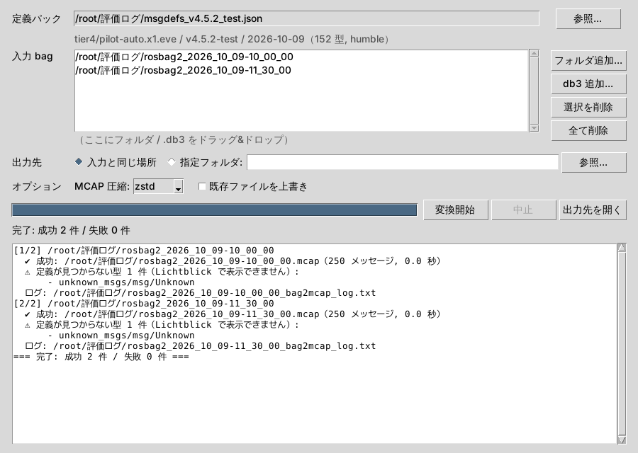

# bag2mcap

ROS 2 rosbag2（sqlite3 / `.db3`）を **MCAP** に変換する Windows 向け GUI ツールです。
ROS 2 をインストールしていない PC でも、pilot-auto.x1.eve で記録した bag を **Lichtblick** で再生・解析できるようにします。



## 特長

- ROS 2・Python のインストール不要（exe 一式を zip で配布）
- 分割 bag、圧縮 bag（ファイル単位 / メッセージ単位 zstd）、metadata.yaml の無い bag（記録が途中で終了したもの）に対応
- メッセージはデコードせずに格納するため高速で、データを改変しない（入力は読み取り専用）
- メッセージ定義は外部の **定義パック**（JSON）から読み込む。pilot-auto のバージョンアップ時は定義パックを差し替えるだけで対応できる
- 変換後に件数を照合し、ログを保存する

## ドキュメント

| 文書 | 対象 |
|---|---|
| [docs/USER_GUIDE.md](docs/USER_GUIDE.md) | 利用者向けの使い方 |
| [docs/msgdefs_admin_guide.md](docs/msgdefs_admin_guide.md) | 管理者向けの定義パック作成手順（Claude への依頼テンプレートあり） |
| [docs/SPEC.md](docs/SPEC.md) | 仕様書 |

## 開発

```bash
python -m venv .venv && . .venv/bin/activate   # Windows: .venv\Scripts\activate
pip install -r requirements-dev.txt && pip install -e .
python -m pytest -q          # テスト
python -m bag2mcap           # GUI 起動
python -m bag2mcap -h        # コマンドライン版
```

Windows 用 exe は `packaging\build_exe.bat`、または GitHub Actions（`build-windows`）の成果物として作成されます。

## 構成

```
src/bag2mcap/   bagreader.py（db3 読み込み）, converter.py（MCAP 書き込み・検証）, msgdefs.py（定義パック）, gui.py, cli.py
tools/          fetch_sources.py（autoware.repos の取得）, build_msgdefs.py（定義パック作成・確認）
tests/          Humble 形式の bag を生成して変換・デコードを検証するテスト
msgdefs/        定義パック置き場（社外秘のため Git 管理外）
```
